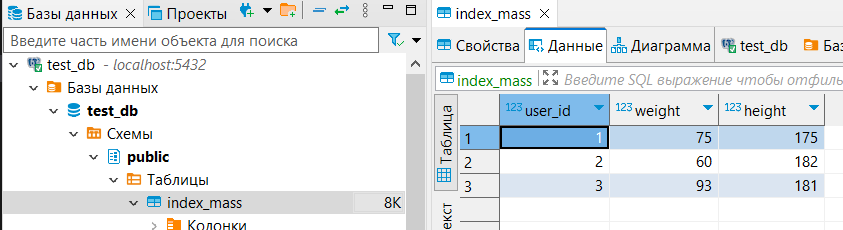

# Docker-1T-Data-training

## Starting a single database
1. Move to db folder - `cd db`
2. Build image by using command `docker build -t test_image:latest .`
3. Run container - `docker run -d -p 5432:5432 --name test_container test_image:latest`
4. Check the container by using `docker ps`

Finally, the result will be as follows:\


## Connecting to database in container
In order to connect to the created test database, you need to run the following command:
```
docker exec -it test_container psql -U test -d test_db
```
This will open the psql shell\


And we can execute several commands in the table
```
test_db=# \dt
test_db=# SELECT * FROM index_mass;
```


## Connecting volumes or how to save the added values to the table if you delete the container and create it again ##
When starting the docker container, you need to run it with the following command:
```
docker run -d -p 5432:5432 -v ./data:/var/lib/postgresql/data --name test_container test_image:latest
```
If you have working container (check it by using `docker ps`), stop and delete it. Then use the command above.
For example:
```
docker stop test_container
docker rm test_container
docker run -d -p 5432:5432 -v ./data:/var/lib/postgresql/data --name test_container test_image:latest
```


You can also use the --rm flag in the command so that when the container is stopped, it is immediately deleted\


For example, you can connect to psql in container, delete row:\


Next, stop container and run it again:\


Connect and check result:\


## Running test database using docker-compose
1. Move to db folder - `cd db` if you're not there yet
2. Start container using `docker-compose up -d`
3. Check result - `docker-compose ps`

## Running two test containers in a bundle and sequentially using docker-compose
This example you can see [here](./app/README.md)