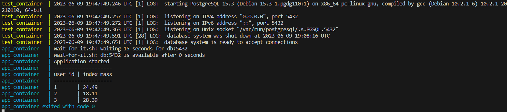

# Running two containers sequentially

## Running containers
To run it, just go to this directory and enter the `docker-compose up` command

## About
Two containers are created in conjunction - one with a database, db service, and the second with a python application - app service.
In order for the application to start after the database is completely started, the [wait-for-it.sh](./wait-for-it.sh) script is used, which polls the database and, after a successful response from it, launches the app.py application.
The wait-for-it script was taken from here: [vishnubob/wait-for-it](https://github.com/vishnubob/wait-for-it).
The script helped a lot to solve the problem with the sequential launch of several containers

## Result
The result will be as follows:\
